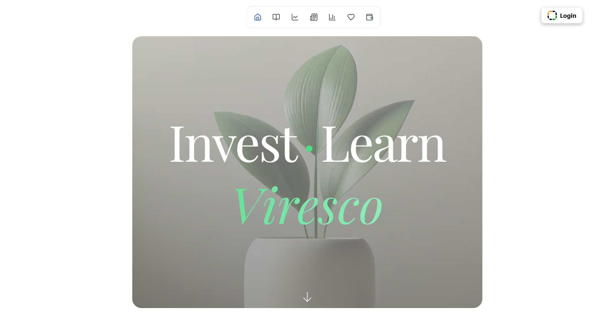

<div align="center">
  <picture>
    <source srcset="./assets/logo.webp" type="image/webp" />
    
  </picture>
</div>

# Viresco 🌱

[](https://choosealicense.com/licenses/mit/)
[](https://api.viresco.dev/health)

> *Empowering Sustainable Finance Through Technology*

🌱 **Invest** • 📚 **Learn** • 🌍 **Grow Green**

<div align="center">
  
</div>

---

## 📋 Table of Contents

- [Overview](#overview)
- [Core Features](#-core-features)
- [Architecture](#-architecture)
- [Technology Stack](#-technology-stack)
- [Getting Started](#-getting-started)
- [Development](#-development)
- [Environmental Impact](#-environmental-impact)
- [License](#-license)

## Overview

Viresco revolutionizes sustainable finance by providing a comprehensive platform that seamlessly integrates:
- Advanced portfolio management with environmental impact tracking
- AI-powered personalized learning experiences
- Blockchain-based carbon credit system and NFT's
- Privacy-first authentication using zero-knowledge proofs
- Real-time market insights and eco-conscious recommendations
- IPFS-based decentralized storage for enhanced security and reliability

## 🔑 Core Features

### Authentication & Security
- **Zero-Knowledge Authentication**
  - Anon Aadhaar integration for secure identity verification
  - Age verification (18+) without PII exposure
  - Multi-factor authentication support
  - Encrypted data storage and transmission
  - IPFS integration for decentralized data storage

### Portfolio Management
- **Comprehensive Asset Tracking**
  - Multi-asset portfolio dashboard (stocks, FDs, mutual funds, cryptocurrency)
  - Real-time performance monitoring
  - Environmental impact metrics
  - Custom watchlists and alerts

- **Environmental Impact Assessment**
  - Carbon footprint calculation per investment
  - Sustainability scoring
  - NFT-based carbon credits
  - Impact comparison tools

### AI-Powered Learning Platform
- **Personalized Education**
  - Dynamic course generation based on user proficiency
  - Customised AI tutors
  - Voice-enabled interactive sessions
  - Progress tracking and analytics

- **Smart Features**
  - Automated market analysis
  - Personalized investment recommendations
  - Real-time news filtering and relevance scoring
  - Voice-assisted portfolio management

## 🏗 Architecture

<div align="center">
  
</div>

## 🛠 Technology Stack

### Frontend Technologies
  - React 18+ with TypeScript
  - Vite for build optimization
  - TailwindCSS for styling
  - Framer Motion for animations
  - React Query for API caching

### Backend Technologies
- **API Layer**
  - FastAPI framework
  - Python 3.8+
  - AsyncIO for concurrency

- **AI/ML Stack**
  - Gemini API for NLP
  - ElevenLabs for voice synthesis
  - Phidata framework for AI agents

- **Blockchain Integration**
  - Web3.js for client-side
  - Ethereum smart contracts
  - IPFS for decentralized storage

## 🚀 Getting Started

### Prerequisites
```bash
# Required versions
Node.js >= 18.0.0
Python >= 3.8.0
Redis >= 6.0.0
Docker >= 20.10.0
```

### Development Environment Setup

1. **Clone the Repository**
```bash
git clone https://github.com/vg239/Viresco.git
cd Viresco
```

2. **Frontend Setup**
```bash
cd frontend
cp .env.example .env
npm install
npm run dev
```

3. **Backend Setup**
```bash
cd backend
python -m venv venv
source venv/bin/activate  # Windows: .\venv\Scripts\activate
pip install -r requirements.txt
cp .env.example .env
```

4. **Environment Configuration**
```bash
# Frontend (.env)
VITE_API_URL=http://localhost:8000
VITE_ELEVENLABS_API_KEY=your_key_here
VITE_WEB3_PROVIDER_URL=your_provider_url
VITE_IPFS_GATEWAY=your_ipfs_gateway

# Backend (.env)
REDIS_URL=redis://localhost:6379
GEMINI_API_KEY=your_key_here
IPFS_NODE_URL=your_ipfs_node_url
```

5. **Database Setup**
```bash
docker-compose up -d
```

## 🌍 Environmental Impact

Viresco's commitment to sustainability:

- **Carbon Footprint Tracking**
  - Real-time investment impact monitoring
  - Detailed environmental metrics
  - Sustainability reporting

- **Green Investment Incentives**
  - NFT-based carbon credits
  - Eco-friendly investment rewards
  - Community sustainability challenges

## 📄 License

This project is licensed under the MIT License - see the [LICENSE](LICENSE) file for details.

---

<div align="center">
  
  Built with ❤️ for a sustainable future

</div>
